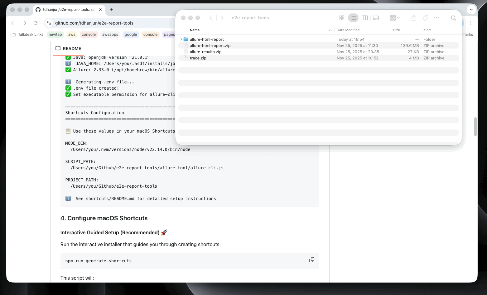
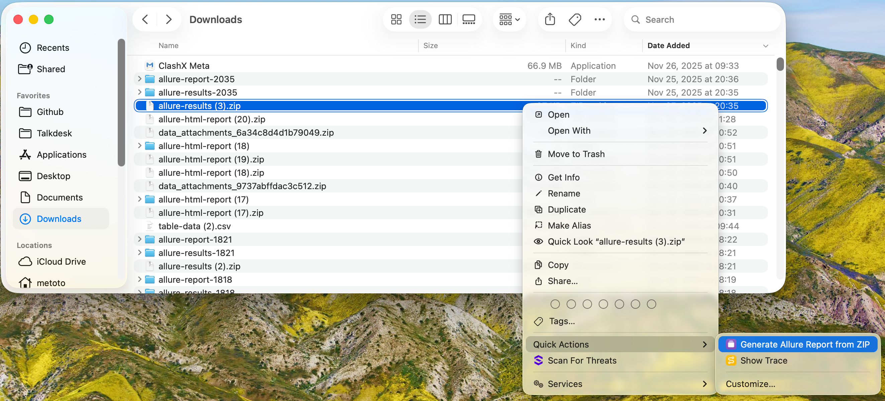
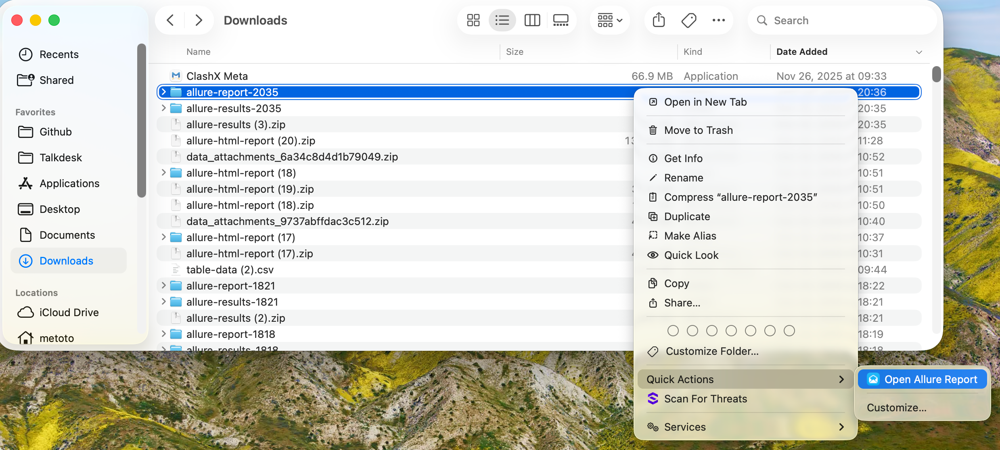
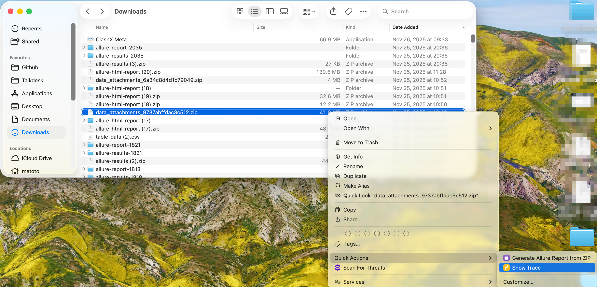

# E2E Report Tools

> 在 macOS 上快速查看 Allure 报告和 Playwright trace 文件，集成 Shortcuts 快捷指令

[English](./README.md) | 中文文档


<!-- TODO: 添加演示 GIF，展示 Finder 中的快捷操作 -->

## 📋 概述

E2E Report Tools 是一个 macOS 实用工具，与 Finder 的快捷操作集成，提供即时访问：

- **Allure 测试报告** - 从测试结果生成并查看 HTML 报告
- **Playwright Trace 文件** - 打开并分析 Playwright 执行轨迹

只需在 Finder 中右键点击文件并选择相应的快捷操作 - 无需打开终端或记住命令！

## ✨ 特性

- 🚀 **一键访问** - 在 Finder 中右键点击文件即可生成/查看报告
- 📦 **智能解压** - 自动处理 `.zip`、`.tar.gz` 和嵌套压缩包
- 🔍 **智能搜索** - 递归查找 `allure-results` 文件夹
- 🌐 **自动打开浏览器** - 自动在默认浏览器中打开报告
- 🎯 **端口管理** - 自动查找可用端口（8000-8010）
- 🔄 **禁用缓存** - 始终显示最新的报告内容
- 🛠️ **简单设置** - 自动化环境检测和配置

## 📦 前置要求

安装前，请确保已安装：

- **macOS** 12.0 或更高版本
- **Node.js** 18.0 或更高版本
- **Java** 11 或更高版本（用于 Allure）
- **Allure** 2.0 或更高版本

### 快速安装依赖

```bash
# 安装 Homebrew（如果尚未安装）
/bin/bash -c "$(curl -fsSL https://raw.githubusercontent.com/Homebrew/install/HEAD/install.sh)"

# 安装 Java
brew install openjdk@21

# 安装 Allure
brew install allure

# 安装 Node.js（如果未使用 nvm）
brew install node
```

## 🚀 快速开始

### 1. 克隆仓库

```bash
git clone https://github.com/tdhanjun/e2e-report-tools.git
cd e2e-report-tools
```

### 2. 安装依赖

```bash
npm install
```

### 3. 运行设置

```bash
npm run setup
```

此命令将：

- ✅ 检测你的 Node.js、Java 和 Allure 安装
- ✅ 生成 `.env` 配置文件
- ✅ 为脚本设置可执行权限
- ✅ 显示 Shortcuts 配置所需的路径

输出示例：

```text
==================================================
E2E Report Tools Setup
==================================================

🔍 Detecting environment...

✅ Node.js: v22.14.0 (/Users/you/.nvm/versions/node/v22.14.0/bin/node)
✅ Java: openjdk version "21.0.1"
ℹ️  JAVA_HOME: /Users/you/.asdf/installs/java/openjdk-21
✅ Allure: 2.33.0 (/opt/homebrew/bin/allure)

ℹ️  Generating .env file...
✅ .env file created!
✅ Set executable permission for allure-cli.js

==================================================
Shortcuts Configuration
==================================================

📋 Use these values in your macOS Shortcuts:

NODE_BIN:
  /Users/you/.nvm/versions/node/v22.14.0/bin/node

SCRIPT_PATH:
  /Users/you/Github/e2e-report-tools/allure-tool/allure-cli.js

PROJECT_PATH:
  /Users/you/Github/e2e-report-tools

ℹ️  See shortcuts/README.md for detailed setup instructions
```

### 4. 配置 macOS Shortcuts

#### 交互式引导安装（推荐）🚀

运行交互式安装程序，它会引导你逐步创建快捷指令：

```bash
npm run generate-shortcuts
```

这个脚本会：
- ✅ 引导你打开 Shortcuts 应用
- ✅ 逐步指导你创建每个快捷指令
- ✅ **自动复制脚本到剪贴板** - 你只需粘贴！
- ✅ 清楚地显示每个快捷指令需要配置什么

完成全部 3 个快捷指令只需约 **2 分钟**。

> **为什么不能全自动？** macOS 安全限制阻止通过命令行创建快捷指令。这种引导式方法是最快的可行方案！

#### 手动配置

如果你想自己配置，请按照 [`shortcuts/README.md`](shortcuts/README.md) 中的详细指南操作。

## 🎯 使用方法

配置完成后，使用工具非常简单：

### 生成 Allure 报告

1. 在 Finder 中找到你的测试结果 `.zip` 文件
2. **右键点击**该文件
3. 选择 **快捷操作** → **Generate Allure Report**
4. 报告将自动在浏览器中打开


<!-- TODO: 添加截图 -->

### 打开现有报告

1. 在 Finder 中找到 `report` 文件夹
2. **右键点击**该文件夹
3. 选择 **快捷操作** → **Open Allure Report**
4. 报告将在浏览器中打开


<!-- TODO: 添加截图 -->

### 查看 Playwright Trace

1. 在 Finder 中找到你的 trace `.zip` 文件
2. **右键点击**该文件
3. 选择 **快捷操作** → **Open Trace**
4. Playwright Trace Viewer 将自动启动


<!-- TODO: 添加截图 -->

## 🛠️ 命令行使用

你也可以直接从命令行使用该工具：

```bash
# 从 zip 文件生成 Allure 报告
node allure-tool/allure-cli.js run /path/to/allure-results.zip

# 打开现有报告文件夹
node allure-tool/allure-cli.js open /path/to/report

# 打开 Playwright trace 文件
node allure-tool/allure-cli.js trace /path/to/trace.zip
```

## 📁 项目结构

```
e2e-report-tools/
├── .env.example              # 配置模板
├── .gitignore                # Git 忽略规则
├── package.json              # 项目依赖
├── setup.js                  # 环境设置脚本
├── README.md                 # 英文文档
├── README.zh-CN.md          # 本文件（中文文档）
├── allure-tool/
│   └── allure-cli.js        # 主 CLI 工具
└── shortcuts/
    ├── README.md            # Shortcuts 设置指南
    ├── install-shortcuts.sh # 安装辅助脚本
    ├── templates/           # 快捷指令模板
    │   ├── generateAllureReport.template
    │   ├── openAllureReport.template
    │   └── openTrace.template
    ├── generateAllureReport  # 你的原始文件
    ├── openAllureReport      # （供参考）
    └── openTrace
```

## 🔧 配置

`.env` 文件包含所有配置：

```bash
# Java 配置
JAVA_HOME=/path/to/java

# Allure 配置
ALLURE_BIN=/path/to/allure

# Node 配置（用于 Shortcuts）
NODE_BIN=/path/to/node

# 项目路径（用于 Shortcuts）
PROJECT_PATH=/path/to/e2e-report-tools
SCRIPT_PATH=/path/to/e2e-report-tools/allure-tool/allure-cli.js
```

这些值由 `npm run setup` 自动检测和配置。

## 🐛 故障排查

### 设置问题

**问题**: `npm run setup` 报告缺少依赖

**解决方案**: 安装缺少的软件：

```bash
# 安装 Java
brew install openjdk@21

# 安装 Allure
brew install allure
```

---

**问题**: 检测到错误的 Java 版本

**解决方案**: 手动设置 `JAVA_HOME`：

```bash
# 查找 Java 安装
/usr/libexec/java_home -V

# 设置 JAVA_HOME 为所需版本
export JAVA_HOME=$(/usr/libexec/java_home -v 21)
```

### Shortcuts 问题

**问题**: 快捷操作未出现在快捷操作菜单中

**解决方案**:

1. 打开 **系统设置** → **扩展** → **访达**
2. 在 **快捷操作** 下启用你的快捷指令

---

**问题**: 权限被拒绝错误

**解决方案**:

1. 前往 **系统设置** → **隐私与安全性** → **自动化**
2. 启用 **快捷指令** 以控制 **访达**
3. 前往 **隐私与安全性** → **文件和文件夹**
4. 授予 **快捷指令** 访问必要文件夹的权限

---

**问题**: 脚本执行失败

**解决方案**: 检查日志文件：

```bash
tail -f /tmp/allure-cli.log
```

### 运行时问题

**问题**: "配置缺失"错误

**解决方案**: 重新运行设置：

```bash
npm run setup
```

---

**问题**: 端口已被占用

**解决方案**: 工具会自动查找可用端口（8000-8010）。如果所有端口都被占用，请关闭其他服务或在 `allure-tool/allure-cli.js` 中更改端口范围。

---

**问题**: 报告显示旧数据

**解决方案**: 服务器配置了禁用缓存头。尝试：

1. 强制刷新浏览器（Cmd+Shift+R）
2. 清除浏览器缓存
3. 重启脚本

## 📝 高级用法

### 查看配置

显示当前配置值：

```bash
npm run shortcuts-info
```

### 手动路径配置

如果自动检测失败，手动编辑 `.env`：

```bash
cp .env.example .env
# 使用你喜欢的文本编辑器编辑 .env
nano .env
```

### 自定义端口范围

编辑 `allure-tool/allure-cli.js`：

```javascript
const BASE_PORT = 8000;  // 更改起始端口
const MAX_PORT = 8010;   // 更改结束端口
```

## 🤝 贡献

欢迎贡献！请随时提交 Pull Request。

1. Fork 本仓库
2. 创建你的功能分支（`git checkout -b feature/AmazingFeature`）
3. 提交你的更改（`git commit -m 'Add some AmazingFeature'`）
4. 推送到分支（`git push origin feature/AmazingFeature`）
5. 开启一个 Pull Request

## 📄 许可证

本项目采用 MIT 许可证 - 详见 [LICENSE](LICENSE) 文件。

## 🙏 致谢

- [Allure Framework](https://docs.qameta.io/allure/) - 精美的测试报告
- [Playwright](https://playwright.dev/) - 现代 Web 测试框架
- macOS Shortcuts - macOS 上的自动化工具

## 📮 联系方式

- GitHub: [@tdhanjun](https://github.com/tdhanjun)
- Issues: [报告问题](https://github.com/tdhanjun/e2e-report-tools/issues)

---

**祝测试愉快！** 🎉
